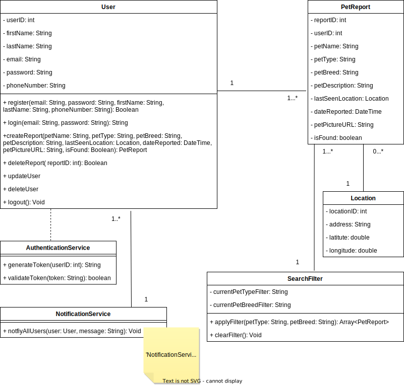

# Domain Model

By creating a domain model, it becomes easier to identify and describe the business processes and requirements that need to be supported by the lost my pet app.

# User stories

User  
As a user, I want to create an account with my contact information, to save my contact credentials.  
As a user, I want to upload a photo of my lost pet, so that other can help me find it.   
As a user, I want to share the last seen location of my lost pet, so that others in the region can help me find it.   
As a user, I want to receive push notifications when a lost pet is reported, so I can help with the search.  
As a user, I want to view listings of missing pets in my area, to potentially recognize and return them.  
As a user, I want to delete my post, so nobody continues searching for my pet, after it has been found and returned.  

# Use Case Diagram

A use case diagram is a diagram that represents the interactions between actors and the lost my pet app, and the specific tasks or functions the system performs in response to those interactions.

# UML Class Diagram

